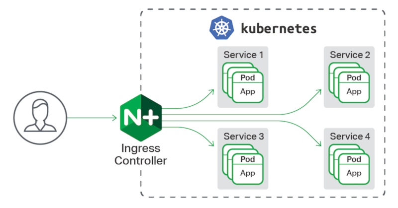
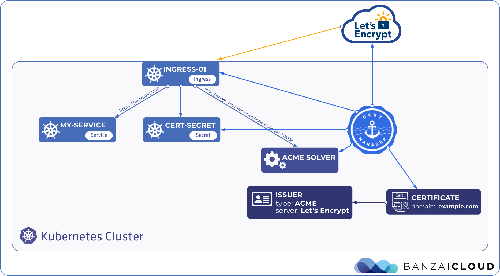

# letsEncryptKubernetes
Master Class de como utilizando Ngnix Ingress Controller, Cert Manager y Lets Encrypt para crear y utilizar certificados de seguridad firmados en Kubernetes.

## Entender lo que vamos a hacer

Kubernetes es un orquestador de contenedores. Lo que haremos a continuación es dentro de un cluster de kubernetes de DigitalOcean instalar Nginx Ingress Controller y Cert Manager dentro de ese cluster para generara certificados de Seguridad con Let's Encrypt.

## ¿Qué es Nginx Ingress Controller?

Nginx Ingress Controller es un enrutador o router de las peticiones que le realicen al servidor. Este es un servicio de tipo LoadBalancer que redireccina el tráfico al servicio de la aplicación que se desee segun su nombre de dominio.

Por ejemplo si tenemos una aplicación web con dominio midominio.com, ingress es un servcio encarcado de enrutar esa petición al servicio al que este mapeado ese dominio, este se configura con un archivo .yaml, lo veremos más adelante.

## ¿Qué es Cert Manager?

Cert Manager es un servicio que se comunica con el pod de Ingress Controller. Para administrar y gestionar los certificados de seguridad de los dominios definidos en Ingress Controller.

Para este servicio es necesario crear 
Custom Resource Definitions llamados Issuer y Cluster Issuer, que son los recursos encargados de comunicarse con el proveedor de certificados, en este caso Let's Encrypt.

## Como comenzar
### Paso 1: Instalar Ingress Controller
Primero hay que crear un namespace para el ingress controller y un serviceAccount para el mismo que se necesitará.

Visualizar el archivo:
[01-ns-and-sa.yaml](./ingress/01-ns-and-sa.yaml)

Luego hay que crear un cluster role binding de ngnix ingress controller:

`kubectl create clusterrolebinding nginx-ingress-admin -n nginx-ingress  --clusterrole=cluster-admin  --serviceaccount=nginx-ingress:nginx-ingress`

Luego Se instalan los Custom Resource Definitions de Ingres:

Visualizar la carpeta:
[./crds](./crds/)

Por ultimo tienen que correr los archivos de configuración de ingress.

Visualizar la carpeta:
[./ingress](./ingress/)

### Paso 2: Instalar Cert Manager
En este caso es más rápido ya que usaremos helm para instalar Cert Manager.

Primero creamos el namespace de CertManager

`kubectl create namespace cert-manager`

Luego instalamos con helm con los siguientes comandos.

`helm repo add jetstack https://charts.jetstack.io`
`helm repo update`
`helm install cert-manager jetstack/cert-manager --namespace cert-manager --version v1.2.0 --set installCRDs=true`

Este es un tip que nos va a servir adelante:
comando para ver challenges:
`kubectl describe challenge`

Ahora Crearemos la instancias de un Custom Resources definitions. Vamos a crear un ClusterIssuer. Este sera el encargado de comunicarse con Let's Encrypt.

Visualizar la carpeta:
[./cert-manager](./cert-manager/)

### Paso 3: Instalar App y Crear certificados

Por último debes instalar la app web que tu hayas desarrollado y crear el enrutador ingress que redireccionara el trafico con sus certificados para ver un ejemplo por favor ver carpeta: [./app](./app/)

## Espero les haya gustado la clase.
Alejandro Lembke Barrientos

